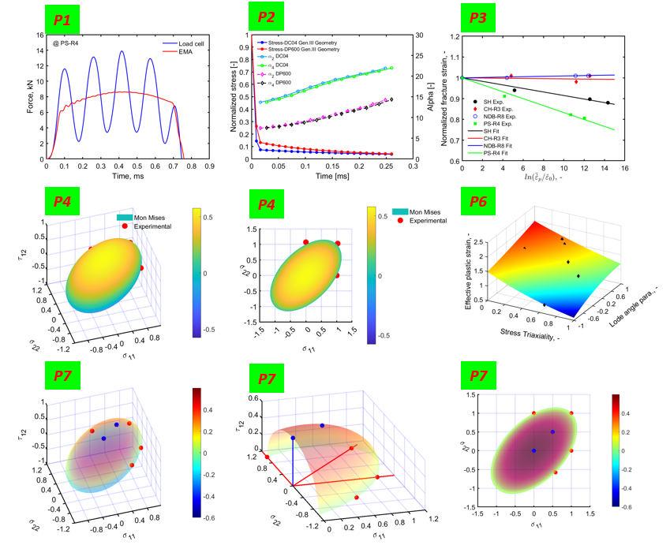
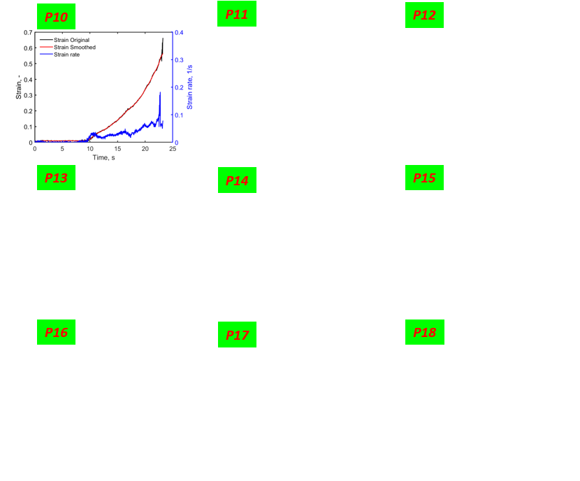

# MATLAB_Plot

This repository contains several data processing and visualization scripts and functions currently used at FLB in Siegen.
All available scripts are written for [Mathworks MATLAB](https://de.mathworks.com/products/matlab.html).

 

*Chongyang Zeng, M.Sc.* 
*Max-Maria Bisch, M.Sc.* 
*Team Material Mechanics* 
*Universität Siegen/University of Siegen* 
*Lehrstuhl für Fahrzeugleichtbau/Institute of Automotive Lightweight Design* 
*Breite Straße 11* 
*57076 Siegen* 
*Homepage: www.mb.uni-siegen.de/fahrzeugleichtbau* 
